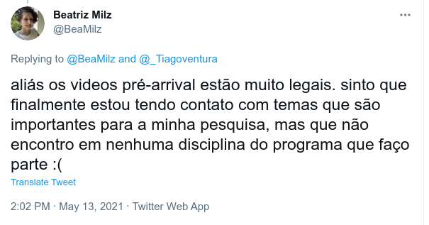

```{r setup, include=FALSE}
options(htmltools.dir.version = FALSE)
knitr::opts_chunk$set(messagwese=FALSE, warning = FALSE)
xaringanthemer::style_mono_light(base_color ="#23395b", 
                                  title_slide_text_color="#23395b", 
                                  title_slide_background_color = "#fbf9f4", 
                                  background_color = "#fbf9f4", 
                                  link_color =  "#F21A00")

``` 

# Bem-vindos!

```{r echo=FALSE, out.width="150%"}
knitr::include_graphics("https://media.giphy.com/media/OF0yOAufcWLfi/giphy.gif")
```

---

## Sobre SICSS DAPP-FGV

#### Organizadores

- Tiago Ventura (SICSS, Princeton 2019)

- Amaro Grassi (Diretor de Pesquisas da DAPP)

- Danilo Carvalho (Diretor de Dados da DAPP)

#### Monitores

- Polyana Barbosa (Pesquisadora da DAPP)

- Lucas Roberto (Pesquisador da DAPP)

- Thiago Meirelles (Doutorando Ciencia Política USP)


---

### Vocês

- Em torno de 25 participantes

- **Aréas de Pesquisa:** Economia, Ciência Política, Ciência da Computação, Journalismo, Sociologia, Psicologia, Estudos de Defesa, Ciência Ambiental, Antropologia, Direito, e Comunicação. 

- Maior parte doutorandos, porém, temos pósdocs e pesquisadores do terceiro setor. 

- [As bios de vocês](https://sicss.io/2021/fgv-dapp-brazil/people)

---

## Visão Geral do SICSS DAPP FGV

- Duas semanas de encontros (14 até 25 de Junho)

- Reuniões via Zoom entre 10 AM até 5 PM na maior parte dos dias. 

- Flipped Classroom

    - **[Vídeos](https://sicss.io/curriculum)** das aulas devem (deviam) ser assistidos com antecedência. 
    
    - Sessões ao vivo serão um misto de trabalhos em grupos e discussões. 
    
- Um dia típico do SICSS consistirá em atividades em grupo, discussões e um convidado especial. 

---
## Convidados Especiais

.pull-left[
- Marco Aurélio Ruediger

- Cesar Zucco

- Thiago Marzagão

- Patricia Rossini

- Ernesto Calvo

- Rochelle Therman
]

.pull-right[
- Cecília Oliveira

- Cristina Tardáguila

- Natália Leão

- Fernanda Scovino

- Daniel Mariani

- Marcelo Soares
]

---

## Workshops

- A Base dos Dados com Fernanda Scovino (21 Junhp).

- Automated Text Analysis with Spacy and LDAviz com Lucas Roberto (16 Junho).

- Auditoria Algorítimica (Hoje) com Daniel Trielli.

---

## O que é Ciência Social Computacional?


.pull-left[
<iframe width="560" height="315" src="https://www.youtube.com/embed/zGG9wPl1C5E" title="YouTube video player" frameborder="0" allow="accelerometer; autoplay; clipboard-write; encrypted-media; gyroscope; picture-in-picture" allowfullscreen></iframe>
]

--
.pull-right[

<br>

- Anything that is cool.

- Readymades + Custommades Data.

- Data Science <-> Social Science.

]

--
---
## Porquê o SICSS?

.pull-left[
<iframe width="560" height="315" src="https://www.youtube.com/embed/K6HzpZMcaQw" title="YouTube video player" frameborder="0" allow="accelerometer; autoplay; clipboard-write; encrypted-media; gyroscope; picture-in-picture" allowfullscreen></iframe>
]

--

.pull-right[

- Rare Free Learning Opportunities.

- Grow together and challenge interdisciplinary barriers

- Teach the Teachers.

- Create a diverse community.

]

--

---

## Porquê o SICSS Brasil? 


--

```{r echo=FALSE, out.width="80%"}

```

--


---

## Porquê o SICSS Brasil? 

- Enorme demanda cientistas sociais (em todos os níveis) por treinamento em métodos computacionais. 

- Demanda do mercado profissional e acadêmico por cientistas sociais com esta formação.

- Absolutamente nenhuma iniciativa de treinamento **gratuita** na escala do SICSS no Brasil. 


---

## Objetivos do SICSS Brasil. 

**Nosso objetivo foi trazer esta oportunidade de treinamento para alunos-as brasileiros. E com isso:**

- Construir mais redes de comunicação entre ciêntistas sociais computacionais no Brasil. 

- Hub interdisciplinar a partir do SICSS Brasil.

- Agregar alunos-as com experiências e históricos distintos no campo. 

- Ampliar a diversidade em CSS [Vary CSS](http://varycss.org/)

- Permitir o surgimento de novas, criativas e interdisciplinares idéias de pesquisa.  

---
## Programação: Semana 1

- Dia 1: Ética + Workshop sobre Bias Algorítimico.

- Dia 2: Coleta de Dados Digitais + Convidada: Patrícia Rossini.

- Dia 3: Dados em formato de Texto + Workshop: Spacy e LDA

- Dia 4: Survey + Convidado: Cesar Zucco

- Dia 5: Colaboração em Massa e Modelos de Aprendizar + Convidado: Thiago Marzagão.


---

## Programação: Semana 2

**DAPP DAY (21 Junho)**

  - Nossos colegas da DAPP vão compartilhar um pouco sobre suas pesquisas
  
  - Workshop
  
  - Q&A
  
**Mesas Redondas**

- CSS na Academia, Industria e Organizações Sociais.
  
**Trabalhos em Grupo (22 - 25 Junho)**

  - Dividir grupos
  
  - Fazer testes e análises iniciais
  
  - Apresentar resultados no dia 25 de Junho.
  

---
## Programação: Semana 2

Depende de você e dos seus colegas continuar a trabalhar nos projetos pós-SICSS. 

Edital da DAPP: financiamento para os projetos iniciados no SICSS DAPP FGV.

Você pode escolher seus grupos. 

Facilitaremos a geração de ideias de projeto usando um processo para reunir pessoas em pequenos grupos com base nos interesses mais semelhantes e mais diferentes. 

Recomendamos grupos de 2 a 6 pessoas. 

---

### Aproveitando ao máximo do SICSS

O SICSS é uma comunidade. E este senso de comunidade é muito importante. 

- Participe das discussões, engage, e aproveite ao máximo essa oportunidade. 

- Seja respeitosa-a

- Ajude o colega e esteja aberto a receber ajudar. 

**Saia da sua zona de conforto.**

- Interaja com participantes fora da sua área. 

- Aprenda algo novo todos os dias. 


E...

---
### Confie em Você.
.center[
```{r echo=FALSE, out.width="50%"}
knitr::include_graphics("Data_Science_VD.png")
```
]
.footnote[http://drewconway.com/zia/2013/3/26/the-data-science-venn-diagram]
---

## Aproveitando ao máximo o Zoom!

Quando possível, tenha seu câmera ligada

- Silencie o microfone quando não estiver falando

- Use "reações" tanto quanto você gostaria (mantendo o respeito). 👍👏

- “Levante a mão” para interromper ✋

- Tente usar sua voz para responder as perguntas de discussão em grupo.

- Use o chat do Zoom com mais moderação, apenas como complemento de esclarecimentos, reações curtas ou para enviar links de informações.


*Observação: entendemos que estes são tempos desafiadores e, ao longo do dia, podem surgir coisas que o obriguem a se afastar do computador ou desligar o vídeo. Nós entenderemos!*

---

## Aproveitando ao máximo o Slack!

Use o canal #sicss_fgv_dapp o quanto quiser para falar com os participantes

- Você pode criar DMs para conversar com pessoas em atividades em pequenos grupos

- Permite que você compartilhe códigos, links, etc.

- Pode adicionar / verificar informações complementares nos canais de recursos baseados em tópicos

- Pode criar seus próprios canais conforme desejado
  
---
## Feedback

#### Nos contacte sempre que necessário sobre feedback. Sempre há coisas a melhorar. 

- Vamos ter surveys curtos diários para receber feedback (Keep, Start, Stop).

- Ou use o slack #sicss_fgv_dapp. 

- Você também pode contactar participantes do SICSS de outros locais (#general)

---

class: center, middle, inverse

## Perguntas?
---

## Conhecendo vocês

.pull-left[
```{r  echo=FALSE, out.width = "90%"}
knitr::include_graphics("scott.gif") 
```
]


.pull-right[

- Nome e Pronome Preferido. 

- Instituição

- Disciplina

Faremos em breve uma dinâmica mais longa a seguir de apresentações.

]

---

## [Atividade de Apresentação](https://github.com/compsocialscience/summer-institute/blob/master/2020/materials/day1-intro-ethics/small_group_discussions.md).

Dividam-se em grupos de 4 participantes. 

- Apresentem-se e discutam: "O que é CSS para vocês? Quais estudos exemplares que vem em sua cabeça?" (15 min)

- Retorna e discussão das opiniões com tods (10 min)

Novos grupos de 4 participantes

- Apresentem-se e discutam: "O que vocês esperam do SICSS Brasil?" (15 min)

- Discussão com tods (10 min)


