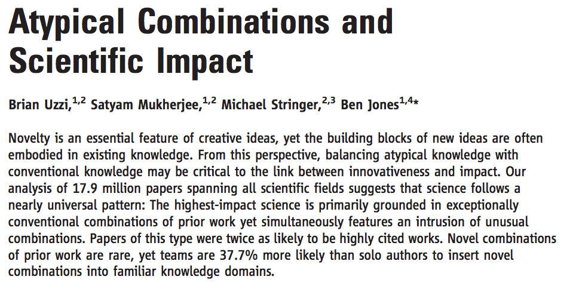
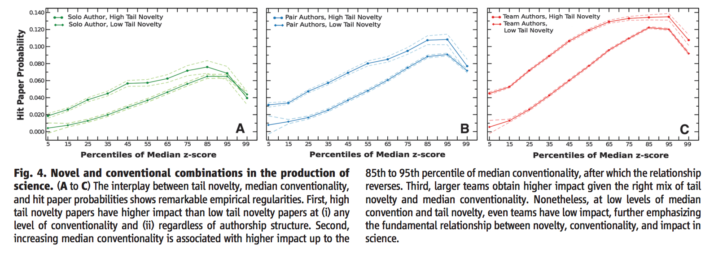
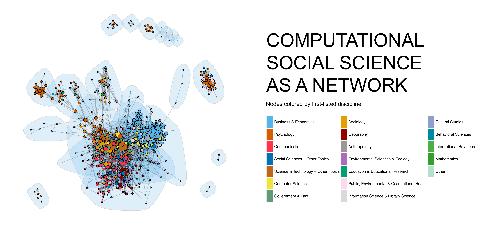

class: center, middle, inverse

# Pontos Positivos de Pesquisas em Grupo. 

---
## Ciência de Mais Qualidade e Maior Impacto.


```{r echo=FALSE, out.width="150%"}

```

---
## Ciência de Maior Impacto.

```{r echo=FALSE, out.width="150%"}

```

---

## Particularmente relevante para CSS


```{r echo=FALSE, out.width="150%"}

```

---
class: center, middle

## Forma mais eficiente de vocês se conhecerem e aprenderem conjuntamente. 


---
class: center, middle, inverse

# Desafios para pesquisa em grupo

---
## Desafios

1. Diversidade tremenda de habilidades entre vocês. 

2. Garantir boa química entre os participantes

3. Tempo limitado entre os alunos. 

4. Free-riding. 

---

## Projetos no SICSS

- Pode vir em sabores distintos (desde pesquisas acadêmicas até a criação de ferramentas de código aberto). 

- Em poucos dias, estes projetos podem ser somente desenhos ou idéias. Porém, alguns grupos podem já pensar em iniciar alguns estudos pilotos. 

- A DAPP FGV abrira um edital para financiamento (suporte tecnico, acesso a dados, e financiamento de pesquisa) para as pesquisas iniciadas por vocês. Mandaremos após o SICSS mais informações de como aplicar para este financiamento. 

---

## Lista de alguns projetos finais do SICSS

- [VaryCSS](http://varycss.org/)

- [The Wisdom of Partisan Crowds](https://www.pnas.org/doi/full/10.1073/pnas.1817195116)

- [The Effect of Streaming Chat on Perceptions of Political Debates](https://academic.oup.com/joc/article-abstract/71/6/947/6415947?redirectedFrom=fulltext&login=false)

- [NLP + CSS 201 tutorials](https://nlp-css-201-tutorials.github.io/nlp-css-201-tutorials/)

- [Projetos do ano passado](https://www.ssrc.org/programs/digital-culture/the-summer-institutes-in-computational-social-science/sicss-research-grantees/) e [outros exemplos](https://sicss.io/projects)

---
## Research Speed Dating


1. Crowdsource uma lista de interesses de pesquisa em um google doc. (5 min)

2. Cada pessoa coloca "1" nos tópicos do seu interesse. E "0" nos que não lhe interessam (5 min)

3. Detectar clusters de interesses similares de participantes. 

4. Detectar clusters mais diversos de participantes. 

---
## Research Speed Dating

1. Discute projetos com seu cluster de interesses similares (60 min)

2. Apresenta idéia aos-as participantes no grupão (30 min)

3. Discute projetos com seu cluster de interesses diversos (60 min)

4. Apresenta idéia aos-as participantes (30 min)

5. Inicia um google doc novo, e cada pessoa coloca seu grupo favorito. 

---
## Planos para a semana

- Hoje: Research Speed Dating

- Segunda & terca & quarta: Trabalhe em seus grupos. 

- Quinta: Apresente resultados e idéias iniciais. 


---
class: center, middle, inverse

## Edital da DAPP


---

# Vamos começar!

Inicie colocando seu nome na primeira coluna, adicione seus interesses de pesquisa, e escreva 1 em todos aqueles que lhe interessam. 

[https://tinyurl.com/SICSSSpeedDating2021](https://tinyurl.com/SICSSSpeedDating2021)


```{r echo=FALSE}
library(countdown)
countdown(minutes = 10, seconds = 0, 
          right = "25%", bottom = "15%",
          margin = "5%",
          font_size = "5em")

```


---

##  Clusters de Interesses Semelhantes

```{r, message = FALSE, echo=FALSE, warning = FALSE}
library(googlesheets4)
library(janitor)
library(naniar)
library(tidyverse)
gs4_deauth()
#link
ss <- "https://docs.google.com/spreadsheets/d/1Uoe_dw5ZY54AdLIHWNn4UO-wS2J_4UAc_SGeYa5C2gs/edit?usp=sharing"
#organizers, change the sheet name to your specific site
dat <- read_sheet(ss, sheet = "Brazil")

#clean variable names
dat <- clean_names(dat)
dat <- dat %>% filter(name != "SAMPLE STUDENT")
#select variables needed for group creation
dat <- dat %>% select(-c(email))
#replace NAs with 0s
dat <- dat %>% replace(is.na(.), 0)

#glimpse(dat)
```

```{r, eval=TRUE, echo = FALSE}
#create distance matrix
dat_mat <- as.matrix(dat)
rownames(dat_mat) <- dat$name
dat_mat <- dat_mat[,-1]
dmatrix <- dist(dat_mat, method = "euclidean") 

#fit with the hierarchical clustering
fit <- hclust(dmatrix, method="ward.D") 

# display dendogram
plot(fit) 
groups <- cutree(fit, k=5)
# cut tree into 5 clusters
# draw dendogram with cut points for groups 
rect.hclust(fit, k=5, border="red")
```
---

## Clusters de Interesse Diversos. 

```{r, eval=TRUE, echo = FALSE}
#identifying maximally dissimilar
final<-as.data.frame(NULL)
dat$names<-NULL
library(dplyr)
library(vegan)

for (i in 1:1000){
  test<-sample_n(dat, 4)
  names<-paste(test$name, collapse=",")
  diversity_score<-diversity(unlist(test[,c(2:ncol(test))]))
  data<-cbind(names, diversity_score)
  final<-rbind(final, data)
}
```

```{r, eval=TRUE, echo = FALSE, out.width="30%"}
#organizers, people may be assigned to more than one group 
#they should choose or you should assign them to one 
final$diversity_score<-as.character(final$diversity_score)
final$diversity_score<-as.numeric(final$diversity_score)
final<-final[order(final$diversity_score, decreasing=TRUE),]

data <- tribble(~names, ~groupo, 
                c( "Tanise", "Luiz Paulo", "Matheus"), 1, 
                c("Jean", "Marcelo", "Patricia", "Jonas"), 2,
                c("Beatriz", "Marcus", "Lorena", "Larissa"), 3,
                c("Nico", "Leonardo", "Gabriel"), 4, 
                c("Victoria", "Amanda", "Luana", "Fernanda"), 5, 
                c("Marisa", "Otavio", "Guilherme"), 6)

knitr::kable(data, format = 'html')


```
---

## Vamos lá. 

Reúna-se primeiro com seu cluster de interesses semelhantes por 60 minutos. E em seguida com seu cluster de interesses mais diversos (60 min).  O organizador do site criará uma planilha onde as idéias do projeto serão listadas. Ao final de cada período de 60 minutos, um representante do grupo deve escrever o nome do projeto e um brief (descrição de menos de três frases), e apresentar a idéia para todos os participantes. Após o final do exercício, coloque seu nome ao lado do projeto de pesquisa que você mais gostaria de ingressar.

Clique no link do google doc do seu site aqui: [Lista de Idéias](https://docs.google.com/document/d/19gOzyfJsP64JMYlO_J4CPT-OL2D71uHPrVrfK-KvynI/edit)


